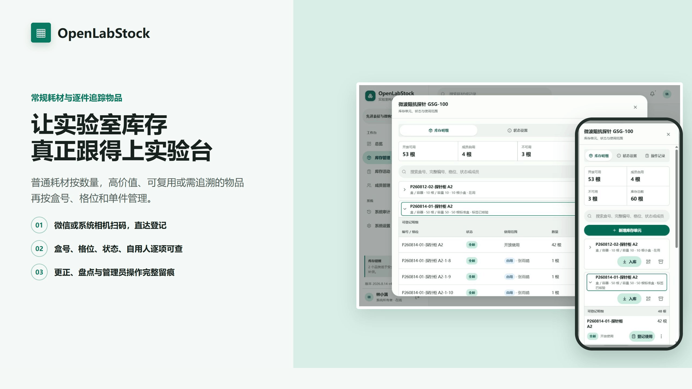
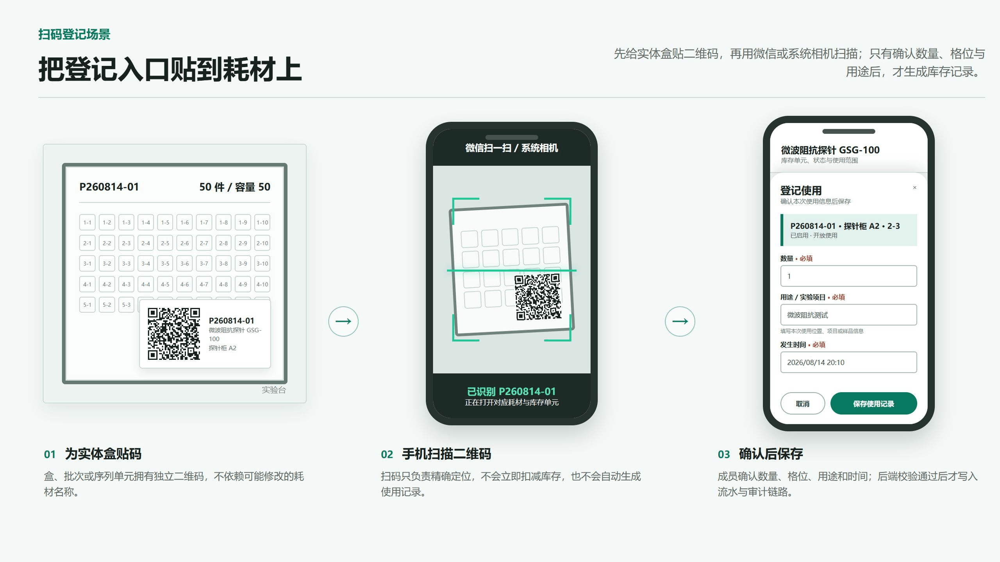

<div align="center">
  
  <h1>OpenLabStock</h1>
  <h2>Inventory that keeps up with the laboratory bench</h2>
  <p>From ordinary consumables to high-value, reusable, or traceability-critical lab items: checkout, QR registration, stocktake, and traceability in one self-hosted workspace.</p>
  <p><a href="./README.md">简体中文</a> · <strong>English</strong></p>
  <p><strong>Note:</strong> the current application interface is Chinese-first. This page is an English project overview, not a claim of complete UI localization.</p>
  <p>
    <a href="https://github.com/okoklabs/openlabstock/actions/workflows/quality.yml"></a>
    <a href="./LICENSE"></a>
    
    
  </p>
</div>



## The hard part is not making another spreadsheet

<p align="center"><strong>Fragmented information, delayed updates, and missing context are where inventory accuracy starts to fail.</strong></p>

Spreadsheets can count what remains. They are much less reliable at answering who used something, which physical item was involved, why a difference appeared, or how an incorrect entry was corrected. OpenLabStock turns those routine problems into explicit workflows.

<table>
  <tr>
    <td width="50%"><h3>Scan to the record; confirm before stock changes</h3><p>Put a QR label on a material or box. WeChat or the built-in scanner opens the exact form; quantity, destination, and time are confirmed before the write.</p></td>
    <td width="50%"><h3>Count ordinary supplies; trace important items</h3><p>Keep gloves and tips simple, while high-value, reusable, or quality-sensitive items can continue down to box, position, state, and reserved member.</p></td>
  </tr>
  <tr>
    <td width="50%"><h3>A use event does not require a fake state change</h3><p>Usage and lifecycle state are separate facts, so a reusable item can accumulate usage history while remaining in the same state.</p></td>
    <td width="50%"><h3>Correct mistakes without erasing history</h3><p>Corrections are explicit reversal records. Original entries, reasons, stocktake differences, and privileged changes remain traceable.</p></td>
  </tr>
</table>

## Put the registration entry point on the material



QR codes bind immutable material or inventory-unit UUIDs rather than editable names. A scan locates the record but never bypasses sign-in, confirmation, or backend validation.

## Useful basics included

<table>
  <tr>
    <td width="33%"><h3>Inbound and checkout</h3><p>Source, destination, note, event time, and the responsible member become one transaction.</p></td>
    <td width="33%"><h3>Safety-stock alerts</h3><p>Set a threshold per material and see replenishment needs on the dashboard and inventory page.</p></td>
    <td width="33%"><h3>Search and personal history</h3><p>Find materials, boxes, positions, states, or members and quickly revisit your own records.</p></td>
  </tr>
  <tr>
    <td width="33%"><h3>Excel and CSV</h3><p>Guarded current-stock import plus inventory, transaction, and organization-consumption exports.</p></td>
    <td width="33%"><h3>Stocktake and review</h3><p>Freeze a ledger snapshot, enter physical counts, explain differences, and adjust only after review.</p></td>
    <td width="33%"><h3>Roles, audit, and backup</h3><p>Backend-enforced roles, privileged-action audit records, consistent SQLite backup, and controlled restore.</p></td>
  </tr>
</table>

## Keep ordinary supplies simple; trace important items only when it pays off

| Model | Best for | What is tracked |
| --- | --- | --- |
| **Quantity** | Gloves, tips, bottles, and tubes | Current quantity, safety stock, inbound and outbound transactions |
| **Stateful pool** | Washable filters, quartz cuvettes, and other items that need states but not box identity | Quantity by configurable state and shared or member-reserved scope |
| **Tracked units** | Precision probes, reference electrodes, calibration standards, sensor modules, lots, and serialized items | Unit identity, exact position, state, reserved member, and every use event |

Teams can begin with ordinary quantity inventory and enable state or unit tracking only where physical traceability is worth the effort.

### When is item-level tracking worth the effort?

Use item or lot tracking when at least one of these conditions applies:

- **High unit value:** loss, damage, or incorrect checkout costs more than the registration effort.
- **Repeated use:** current state and usage history affect the next experiment.
- **The same item must be found again:** it has a box, position, serial number, or fixed location.
- **Quality, safety, or calibration matters:** lot, validity, responsible member, or disposal reason needs traceability.

Examples include precision probes and probe cards, quartz cuvettes, reference electrodes, washable filters, calibration standards, reference samples, sensor modules, microfluidic chips, specialty columns, sample holders and fixtures, gas cylinders, and compact tool kits. When none of these conditions applies, quantity mode avoids unnecessary per-item work.

## One representative scenario: a 50-probe box can still explain position 2-3

<table>
  <tr>
    <td width="68%"><br /><sub><strong>Tablet:</strong> collapsed boxes with mixed shared, reserved, and stateful position details.</sub></td>
    <td width="32%"><br /><sub><strong>Mobile:</strong> the same 50-probe workflow in a compact Material 3 surface.</sub></td>
  </tr>
</table>

- A physical box can contain new, in-use, unavailable, shared, and member-reserved probes at the same time.
- Search by material, box, complete code, position, state, or member.
- Usable stock stays prominent while unavailable entries can remain folded away.
- Usage, state change, scope change, correction, and disposal are separate auditable events.

## Desktop, tablet, and mobile are working surfaces

OpenLabStock uses a compact responsive Material 3 interface. Members can scan, register, and search from a phone; administrators can stocktake, maintain units, and resolve anomalies. Its restricted-network PWA never caches, queues, or replays inventory writes.

Product UI shown in the README comes from the running application with isolated synthetic data. The QR workflow is drawn from the same interface structure. No production database or real member record is included.

## Best fit

- Research teams replacing linked spreadsheets, forms, and chat messages.
- Laboratories with both quantity consumables and high-value, reusable, or quality-sensitive items.
- Shared facilities that need member self-service plus administrator stocktake, correction, and audit.
- Small and medium teams that want data on their own server and straightforward SQLite backups.

OpenLabStock currently targets a single laboratory or organization. It is not intended to replace a large multi-warehouse ERP, procurement and finance suite, LIMS, or electronic lab notebook.

## Quick start

Choose a target first. End users do not need to run tests or production dependency audits before trying the application; those commands belong to development and release gates.

### Local trial

Requirements: Node.js `>=22.12.0` and the repository-declared pnpm version. These commands build and start a local demo instance:

```bash
git clone https://github.com/okoklabs/openlabstock.git
cd openlabstock
corepack enable
pnpm install --frozen-lockfile
pnpm run dev
```

Open <http://127.0.0.1:4388/>. A local non-production database includes two demonstration accounts:

- System owner: `admin` / `admin123`
- Member: `student` / `demo123`

Production mode never creates these demo credentials. Runtime data defaults to the Git-ignored `data/` directory.

### Single-host production

For a Linux server, the Docker single-instance route is the shortest path. It generates the initial password, persists data, and provides scripted update, backup, and rollback commands:

```bash
git clone https://github.com/okoklabs/openlabstock.git /opt/openlabstock-docker
cd /opt/openlabstock-docker
bash deploy/docker/openlabstock.sh init
```

After the script prints the initial `admin` password, sign in and change it immediately. Operators with an existing systemd service, reverse proxy, or manual directory policy should use the systemd route in [`DEPLOYMENT.md`](./DEPLOYMENT.md).

### Choose an installation path

| Goal | Recommended entry | Best for |
| --- | --- | --- |
| Local trial or development | The `pnpm run dev` path above | Exploring the workflow or changing code |
| One Linux server | [`deploy/docker/README.md`](./deploy/docker/README.md) and Docker `init` | Teams that want generated initial credentials, persistent volumes, and scripted updates/rollback |
| Existing systemd and reverse proxy | [`DEPLOYMENT.md`](./DEPLOYMENT.md) and [`deploy/systemd/README.md`](./deploy/systemd/README.md) | Operators who keep the application, SQLite data, and backups separate |

The project is still a public preview; move to a stable release after a clean Linux installation, upgrade, backup, restore, and rollback rehearsal has passed. Production should use a fixed GitHub Release artifact and SHA-256 manifest, not an arbitrary working branch.

## Deployment and verification

- [Deployment overview](./DEPLOYMENT.md)
- [Docker deployment](./deploy/docker/README.md)
- [Production package contract](./deploy/PRODUCTION.md)
- [Documentation map](./docs/DOCUMENTATION.md)
- [System architecture](./docs/BUILD_ARCHITECTURE.md)
- [Inventory tracking model](./docs/INVENTORY_TRACKING.md)
- [QR workflow](./docs/QR_CODE_WORKFLOW.md)

```bash
pnpm run verify:auto     # Select the smallest sufficient gate from the actual changes
pnpm run verify:status   # Show reusable evidence before a release
pnpm run verify          # Full gate for high-risk changes or releases
pnpm run release:prepare -- --next # Bump, verify, package, and smoke-test
```

With no repository changes, `verify:auto` repeats nothing. Runtime changes rerun type checks, the build, and regression tests; license checks rerun only when dependency or license inputs change, and the production dependency audit is reused for 24 hours while dependencies remain unchanged. `release:prepare -- --next` increments the day's revision and creates both the archive and manifest; retry without `--next` after a failure.

## Project status and license

OpenLabStock is publicly available as a preview. The application is functional and regression-tested, while the external-contribution gate, CLA activation, and stable-release review remain in progress. Review the [roadmap](./ROADMAP.md) and [current tasks](./TODO.md) before production planning.

Source code is licensed under [GNU AGPL v3.0 only](./LICENSE), SPDX `AGPL-3.0-only`. Third-party components retain their own licenses; see [NOTICE](./NOTICE) and [THIRD_PARTY_NOTICES.md](./THIRD_PARTY_NOTICES.md). A separate commercial license is planned but is **not currently available**, and the draft [CLA](./CLA.md) is **not active**.

- [Contributing](./CONTRIBUTING.md)
- [Security policy](./SECURITY.md)
- [Code of Conduct](./CODE_OF_CONDUCT.md)
- [Governance](./GOVERNANCE.md)
- [Support boundaries](./SUPPORT.md)
- [Trademark policy](./TRADEMARKS.md)
