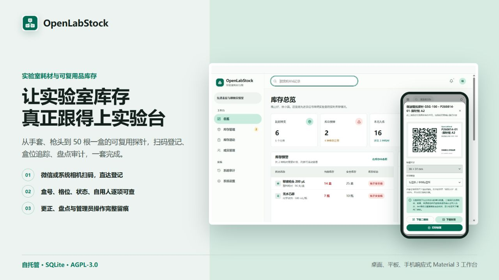
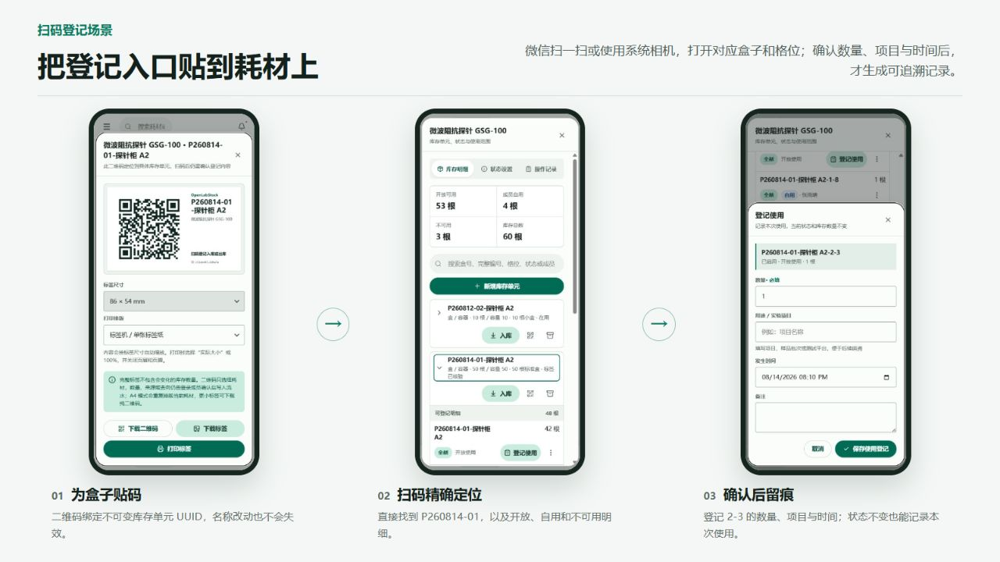
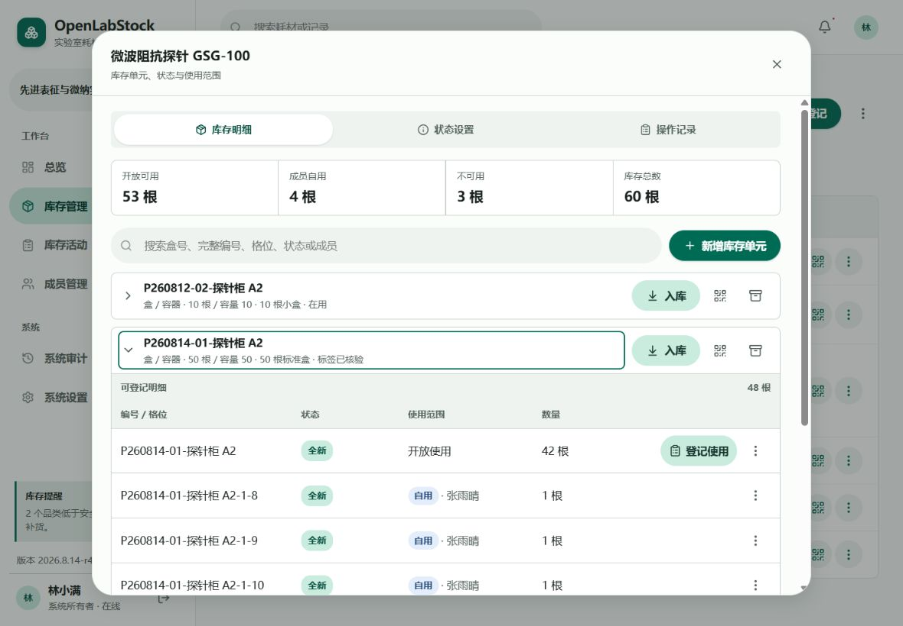
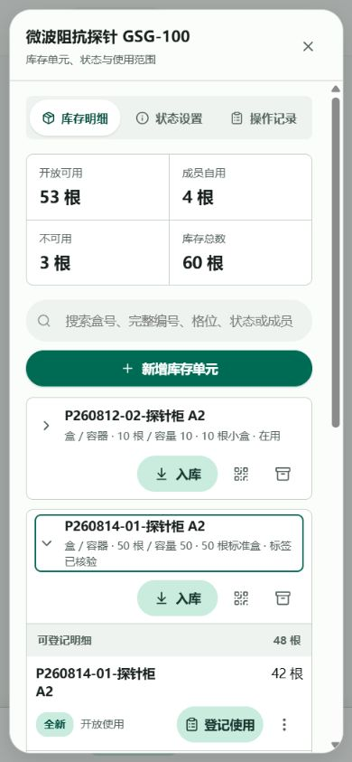

<div align="center">
  
  <h1>OpenLabStock</h1>
  <h2>让实验室库存真正跟得上实验台</h2>
  <p>从手套、枪头到 50 根一盒的可复用探针，把出入库、扫码登记、盘点与追溯放进同一个自托管工作台。</p>
  <p><strong>简体中文</strong> · <a href="./README.en.md">English</a></p>
  <p>
    <a href="https://github.com/okoklabs/openlabstock/actions/workflows/quality.yml"></a>
    <a href="./LICENSE"></a>
    
    
  </p>
  <p><a href="#快速启动"><strong>快速启动</strong></a> · <a href="./DEPLOYMENT.md"><strong>部署文档</strong></a> · <a href="./ROADMAP.md"><strong>路线图</strong></a> · <a href="./CONTRIBUTING.md"><strong>参与贡献</strong></a></p>
</div>



## 实验室库存真正难的，不是做一张表

<p align="center"><strong>信息散、更新慢、发生了什么说不清，才是库存失真的开始。</strong></p>

在线表格可以统计“还有多少”，但很难长期回答：谁领用了、具体用了哪一件、为什么出现差异、填错后怎样规范纠正。OpenLabStock 把这些日常问题做成明确流程，而不是继续增加更多互相联动的表格和表单。

<table>
  <tr>
    <td width="50%">
      <h3>扫码就到，确认才扣</h3>
      <p>把二维码贴在耗材或盒子上。微信或系统相机扫码后直达登记界面，成员确认数量、去向和时间后才写入库存。</p>
    </td>
    <td width="50%">
      <h3>普通耗材算数量，可复用品追单件</h3>
      <p>手套、枪头按数量管理；探针、套件和批次还能按盒号、格位、状态与自用人继续追踪。</p>
    </td>
  </tr>
  <tr>
    <td width="50%">
      <h3>状态不变，也能记录一次使用</h3>
      <p>“使用”是事件，“状态变化”是生命周期。可复用探针被多人使用时，不必伪造状态变化也能留下事实。</p>
    </td>
    <td width="50%">
      <h3>填错可以更正，历史不会消失</h3>
      <p>错误登记通过反向更正处理；原记录、纠正原因和后续变化都保留，盘点与管理员操作也能追溯。</p>
    </td>
  </tr>
</table>

## 把登记入口贴到耗材上



二维码绑定不可变的耗材或库存单元 UUID，而不是可能被修改的名称。扫码只负责定位，不会绕过登录、数量确认和后端校验，也不会发生“一扫就误扣库存”。

## 常用功能，开箱就能用

<table>
  <tr>
    <td width="33%"><h3>出入库与领用</h3><p>入库、领用 / 使用、来源与去向、备注和发生时间统一生成流水。</p></td>
    <td width="33%"><h3>安全库存预警</h3><p>逐耗材设置安全库存线，在总览和库存页及时看到需要补货的品类。</p></td>
    <td width="33%"><h3>搜索与我的记录</h3><p>搜索耗材、盒号、格位、状态或成员；成员可以快速回看自己的登记。</p></td>
  </tr>
  <tr>
    <td width="33%"><h3>Excel / CSV</h3><p>受控导入当前库存，导出库存、完整流水和组织消耗统计。</p></td>
    <td width="33%"><h3>盘点与差异复核</h3><p>创建盘点批次、冻结账面快照、登记实盘数量并解释差异后再调整。</p></td>
    <td width="33%"><h3>权限、审计与备份</h3><p>四级角色由后端校验，关键管理操作留痕，并提供 SQLite 一致性备份与受控恢复。</p></td>
  </tr>
</table>

此外还包括耗材归档与恢复、分页流水、库存预警、分组与成员标签、自定义品牌、二维码标签下载与打印、数据库完整性检查、PWA 和健康检查。

## 简单耗材不变复杂，复杂耗材也不用退回表格

| 库存模型 | 适用对象 | 系统记录什么 |
| --- | --- | --- |
| **普通数量** | 手套、枪头、试剂瓶、离心管 | 当前数量、安全库存、入库与领用流水 |
| **按状态统计** | 需要区分状态、但不需要盒号的可复用品 | 各状态、开放或自用范围下的数量 |
| **按库存单元追踪** | 探针、套件、批次、盒子、格位和序列化物品 | 盒号或单元、精确位置、状态、自用人和每次使用事件 |

这三种模型共用同一套成员、权限、流水、盘点、审计和备份能力。团队可以先从普通数量库存开始，只在确实需要时为某类耗材启用状态或单元追踪。

## 一盒 50 根，也能知道 2-3 发生了什么

<table>
  <tr>
    <td width="68%">
      
      <br /><sub><strong>平板横屏：</strong>盒子默认折叠，展开后查看开放、自用与不同状态的格位明细。</sub>
    </td>
    <td width="32%">
      
      <br /><sub><strong>手机端：</strong>同一套 50 根探针流程压缩为紧凑的 Material 3 操作界面。</sub>
    </td>
  </tr>
</table>

- 同一个物理盒内可以同时存在全新、已启用、不可用、开放使用和成员自用的探针。
- 可按耗材、盒号、完整编号、格位、状态或成员搜索，`2-3` 可以成为真正可查询的位置。
- 可用库存优先展示，不可用明细折叠收起，减少手机端滚动负担。
- 状态名称可以由库存管理员配置；处置、状态变化、使用范围变化与重复使用分别留痕。

## 桌面、平板、手机都能做正事

OpenLabStock 采用紧凑的 Material 3 工作台，不把手机端做成只能查看的附属页面。成员可以扫码、登记和查询，管理员可以盘点、维护库存单元与处理异常。受限联网型 PWA 可安装到桌面，但 Service Worker 不缓存、排队或重放库存写请求。

所有 README 截图均来自实际运行的应用和隔离的合成数据，不包含生产数据库或真实成员资料。

## 适合哪些团队

- 仍在用在线表格、在线表单或群消息联动管理耗材的科研团队。
- 同时存在普通数量耗材和探针、套件等可复用品的实验室。
- 需要成员自助登记，但又希望库存管理员能盘点、纠错和审计的公共平台。
- 希望数据留在自己的服务器，并能直接备份 SQLite 文件的小型或中型团队。

OpenLabStock 当前定位是单实验室或单组织的库存工作台，不试图替代大型多仓 ERP、采购财务系统、LIMS 或电子实验记录本。

## 快速启动

要求 Node.js `>=22.12.0`，以及仓库声明的 pnpm 版本。

```bash
git clone https://github.com/okoklabs/openlabstock.git
cd openlabstock
corepack enable
pnpm install --frozen-lockfile
pnpm run verify:quick
pnpm run build
pnpm run start
```

打开 <http://127.0.0.1:4388/>。仅本地非生产数据库会创建两个演示账号：

- 系统所有者：`admin` / `admin123`
- 普通成员：`student` / `demo123`

生产模式不会创建这些演示密码。第一次生产启动必须通过文档规定的环境变量设置独立的所有者密码。运行数据默认保存在被 Git 忽略的 `data/` 目录。

## 部署与运维

- [部署概览](./DEPLOYMENT.md)：Node/systemd、HTTPS、持久数据、备份、更新和回滚边界。
- [Docker 部署](./deploy/docker/README.md)：仅环回地址监听、数据与备份卷、健康检查和隔离烟测。
- [生产包约定](./deploy/PRODUCTION.md)：发布内容、版本、完整性清单和独立解包启动。

OpenLabStock 默认只监听 `127.0.0.1:4388`，公网访问应通过受控的 HTTPS 反向代理。生产数据库、备份、`.env`、凭据和服务器清单绝不能进入源码、发布包或 Issue。

## 技术基础

| 层级 | 实现 |
| --- | --- |
| Web 应用 | Astro、React、TypeScript、响应式 Material 3、受限联网型 PWA |
| API | Node.js HTTP API、后端权限校验和可信输入校验 |
| 数据 | SQLite、事务写入、自动迁移、不可变历史快照 |
| 运维 | 原生 systemd 或单实例 Docker、健康检查、一致性备份和受控恢复 |

```bash
pnpm run verify:quick   # 日常：文档、许可证、类型和回归测试
pnpm run verify         # 完整构建、测试、审计和发布验证
pnpm run check:docs     # Markdown 本地链接检查
```

修改共享行为前，请先阅读[系统架构](./docs/BUILD_ARCHITECTURE.md)、[库存追踪模型](./docs/INVENTORY_TRACKING.md)、[二维码流程](./docs/QR_CODE_WORKFLOW.md)和[工程工作流](./docs/ENGINEERING_WORKFLOW.md)。

## 项目状态

OpenLabStock 正在准备首次公开发行。应用已经可以运行并有回归测试，但外部贡献门禁、CLA 激活和最终公开审查仍在进行。评估阶段请使用合成数据；规划生产使用前请查看[路线图](./ROADMAP.md)和[当前公开任务](./TODO.md)。

## 许可证与社区

OpenLabStock 原始源代码采用 [GNU AGPL v3.0 only](./LICENSE)，SPDX 标识为 `AGPL-3.0-only`。第三方组件继续适用各自许可证，见 [NOTICE](./NOTICE) 和 [THIRD_PARTY_NOTICES.md](./THIRD_PARTY_NOTICES.md)。

AGPL 允许商业使用，但网络部署、修改和再分发需要遵守源代码可得性义务。项目计划提供单独的商业许可，但目前**尚未开放签约**。当前 [CLA](./CLA.md) 也仍处于**未启用**状态，不能视为已签署协议。

- [贡献指南](./CONTRIBUTING.md)
- [安全策略](./SECURITY.md)
- [行为准则](./CODE_OF_CONDUCT.md)
- [项目治理](./GOVERNANCE.md)
- [支持边界](./SUPPORT.md)
- [商标政策](./TRADEMARKS.md)

<p align="center"><strong>OpenLabStock</strong> · 让实验台前的人愿意登记，也让每条记录经得起追溯。</p>
