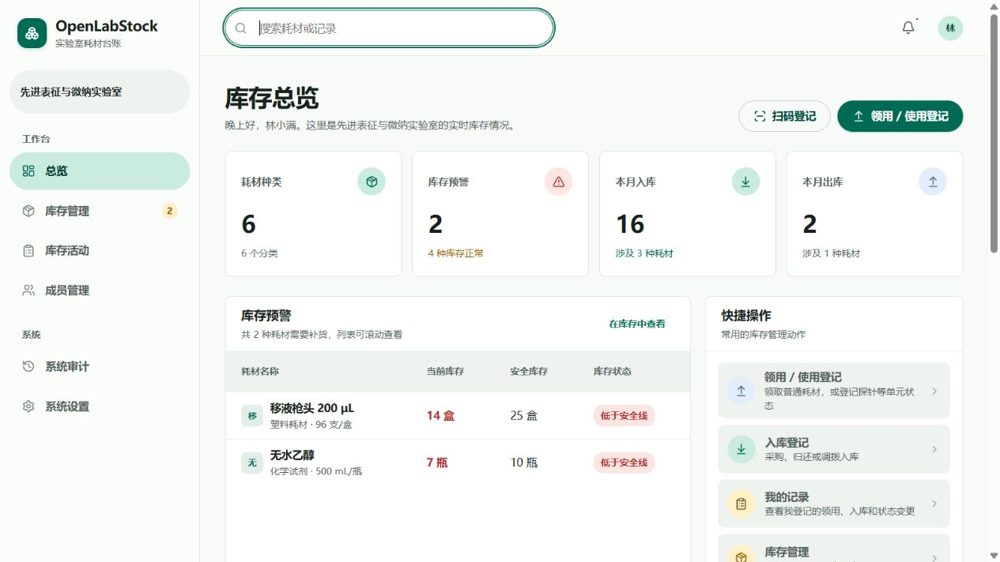
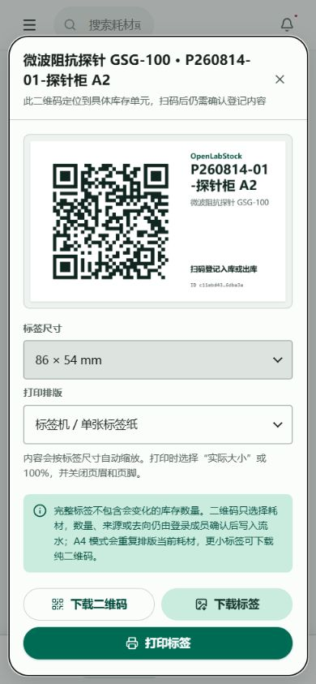

<div align="center">
  
  <h1>OpenLabStock</h1>
  <p><strong>从一次性耗材到可复用探针，一套适合实验室自托管的库存系统。</strong></p>
  <p>把分散的在线表格和表单，变成兼顾库存、使用登记、盘点与单件追溯的响应式工作台。</p>
  <p><a href="./README.md">English</a> · <strong>简体中文</strong></p>
  <p>
    <a href="https://github.com/okoklabs/openlabstock/actions/workflows/quality.yml"></a>
    <a href="./LICENSE"></a>
    
    
  </p>
</div>



## 实验室耗材为什么越来越难管

表格很适合列数量，但当实验室需要回答“**具体哪一件发生了什么**”时，它就会迅速变得脆弱。

| 实际使用场景 | 在线表格或通用领用表的困难 |
| --- | --- |
| 一盒 50 根探针里同时有全新、已使用、不可用、开放和成员自用 | 一个库存数字无法表达混合状态和使用范围 |
| 探针 `2-3` 被另一位成员再次使用，但状态仍然是“已启用” | 状态没有变化，不代表这次使用不需要留痕 |
| 成员填错数量或位置 | 直接删行会破坏历史，更正动作本身也应该可追溯 |
| 货架实物与系统数量不一致 | 只有盘点结果还不够，还需要盘点批次、差异原因和调整链路 |
| 手机登记步骤太多 | 大家会稍后再填，而“实时库存”会悄悄失去实时性 |

OpenLabStock 直接建模这些问题，同时让手套、枪头、试剂瓶等普通数量耗材保持简单。

## OpenLabStock 的核心差异

### 一套系统，三种库存模型

| 模型 | 适用对象 | 系统记录什么 |
| --- | --- | --- |
| **普通数量** | 手套、枪头、试剂瓶、离心管 | 当前数量、安全库存、入库与领用流水 |
| **按状态统计** | 需要区分状态、但不需要盒号的可复用品 | 各状态、开放或自用范围下的数量 |
| **按库存单元追踪** | 探针、套件、批次、盒子、格位和序列化物品 | 盒号或单元、精确位置、状态、自用人和每次使用事件 |

这里有一个刻意保留的重要区别：**使用是一条事件，状态变化是生命周期转换**。同一根可复用探针可以被多次使用，而不必为了记使用记录伪造状态变化。

### 真正按“一盒 50 根探针”管理

- 可按耗材、盒号、完整探针编号、格位、状态或成员搜索。
- 同一个物理盒内可同时存在开放探针和不同成员的自用探针。
- 将“全新”“已启用”“不可用”分开，库存管理员还可自定义状态标签。
- 盒子默认折叠、可用库存优先展示，不可用明细从日常操作区折叠收起。
- 二维码绑定不可变的耗材和库存单元 UUID，而不是可能改名的文字名称。

### 在实验台前扫码，确认后再写入

为耗材或盒子打印二维码。成员可用微信或系统相机扫码，直接打开对应耗材或盒子的领用 / 使用表单，确认数量、去向、格位和备注后再保存。只有最后确认才会生成库存流水和审计记录。

```text
二维码标签 → 微信 / 浏览器扫码 → 精确定位耗材或盒子 → 确认登记 → 库存流水 + 审计记录
```

这样既缩短了现场登记路径，也避免“一扫就误扣库存”这种不可逆操作。

## 真实产品截图

以下截图均来自实际运行的应用和隔离的合成数据，不包含生产数据库或真实成员资料。

<table>
  <tr>
    <td width="60%">
      
      <br /><sub><strong>平板横屏：</strong>两个盒子、汇总数量、混合状态、开放与自用探针。</sub>
    </td>
    <td width="20%">
      
      <br /><sub><strong>手机端：</strong>同一套 50 根探针流程压缩为紧凑的 Material 3 弹窗。</sub>
    </td>
    <td width="20%">
      
      <br /><sub><strong>二维码标签：</strong>下载或打印稳定链接，精确定位到库存单元。</sub>
    </td>
  </tr>
</table>

界面适配桌面、平板和手机，并提供受限联网型 PWA。Service Worker 不缓存、离线排队或重放库存写请求，避免恢复网络后重复扣减。

## 功能亮点

- **高频登记更快：**入库、领用 / 使用、我的记录、全局搜索和安全库存预警。
- **可复用品可追溯：**自定义状态、盒与批次、精确格位、开放 / 自用范围、重复使用事件和受控处置。
- **库存事实不被抹掉：**历史流水不可静默修改，支持显式更正、盘点批次、差异复核和关联调整。
- **系统审计：**管理员可以搜索设置、成员、耗材、盘点、恢复等高权限操作记录。
- **清楚的权限与组织：**系统所有者、系统管理员、库存管理员和普通成员均由后端校验；历史流水保存发生时的分组快照。
- **二维码不锁定平台：**浏览器本地生成和识别二维码，可下载标签，支持 HTTPS 摄像头与图片识别备用路径。
- **导入导出与统计：**受控 Excel 导入、Excel/CSV 导出、服务器分页完整流水和组织消耗统计。
- **适合自托管：**SQLite 一致性备份、完整性检查、受控恢复、systemd 与 Docker 部署、健康检查和回滚指引。

## 与成熟方案的定位区别

OpenLabStock 有意做得比 ERP 或 ELN 更聚焦：它首先解决实验室成员站在耗材柜前，如何让系统记录和手中实物保持一致。

| 产品 | 其公开资料的主要重心 | OpenLabStock 在本场景中的侧重点 |
| --- | --- | --- |
| [Snipe-IT](https://github.com/grokability/snipe-it) | IT 资产、软件许可、分配与保管 | 实验室耗材，以及探针的盒号、格位与混合状态流程 |
| [InvenTree](https://github.com/inventree/InvenTree) | 零部件与库存控制、制造、API 和插件生态 | 更轻的 Node/SQLite 实验室部署，以及库存单元内置使用事件和使用范围 |
| [eLabFTW](https://github.com/elabftw/elabftw) | 电子实验记录本与通用科研资源数据库 | 以现场领用 / 使用、实物盘点和可复用单件身份为核心 |
| [Labguru](https://www.labguru.com/inventory) | 商业 ELN 与实验室库存平台 | AGPL 自托管、本地数据所有权和无需供应商账号的聚焦型工作流 |

这是一份产品定位对照，不是声称所有功能都胜过竞品。上述产品各自擅长更广或不同的问题。表中官方公开资料核对日期为 **2026-08-14**；选型时仍应查看它们的最新文档，并结合自己的合规要求实际评估。

## 本地启动

要求 Node.js `>=22.12.0`，以及仓库声明的 pnpm 版本。

```bash
git clone https://github.com/okoklabs/openlabstock.git
cd openlabstock
corepack enable
pnpm install --frozen-lockfile
pnpm run verify:quick
pnpm run build
pnpm run start
```

打开 <http://127.0.0.1:4388/>。仅本地非生产数据库会创建两个演示账号：

- 系统所有者：`admin` / `admin123`
- 普通成员：`student` / `demo123`

生产模式不会创建这些演示密码。第一次生产启动必须通过文档规定的环境变量设置独立的所有者密码。运行数据默认保存在被 Git 忽略的 `data/` 目录。

## 部署

- [部署概览](./DEPLOYMENT.md)：Node/systemd、HTTPS、持久数据、备份、更新和回滚边界。
- [Docker 部署](./deploy/docker/README.md)：仅环回地址监听、数据与备份卷、健康检查和隔离烟测。
- [生产包约定](./deploy/PRODUCTION.md)：发布内容、版本、完整性清单和独立解包启动。

OpenLabStock 默认只监听 `127.0.0.1:4388`，公网访问应通过受控的 HTTPS 反向代理。生产数据库、备份、`.env`、凭据和服务器清单绝不能进入源码、发布包或 Issue。

## 架构与验证

| 层级 | 实现 |
| --- | --- |
| Web 应用 | Astro、React、TypeScript、响应式 Material 3、受限联网型 PWA |
| API | Node.js HTTP API、后端权限校验和可信输入校验 |
| 数据 | SQLite、事务写入、自动迁移、不可变历史快照 |
| 运维 | 原生 systemd 或单实例 Docker、健康检查、一致性备份和受控恢复 |

```bash
pnpm run verify:quick   # 日常：文档、许可证、类型和回归测试
pnpm run verify         # 完整构建、测试、审计和发布验证
pnpm run check:docs     # Markdown 本地链接检查
```

修改共享行为前，请先阅读[系统架构](./docs/BUILD_ARCHITECTURE.md)、[库存追踪模型](./docs/INVENTORY_TRACKING.md)、[二维码流程](./docs/QR_CODE_WORKFLOW.md)和[工程工作流](./docs/ENGINEERING_WORKFLOW.md)。

## 项目状态与路线图

OpenLabStock 正在准备首次公开发行。应用已经可以运行并有回归测试，但外部贡献门禁、CLA 激活和最终公开审查仍在进行。评估阶段请使用合成数据；规划生产使用前请查看[路线图](./ROADMAP.md)和[当前公开任务](./TODO.md)。

## 许可证与社区

OpenLabStock 原始源代码采用 [GNU AGPL v3.0 only](./LICENSE)，SPDX 标识为 `AGPL-3.0-only`。第三方组件继续适用各自许可证，见 [NOTICE](./NOTICE) 和 [THIRD_PARTY_NOTICES.md](./THIRD_PARTY_NOTICES.md)。

AGPL 允许商业使用，但网络部署、修改和再分发需要遵守源代码可得性义务。项目计划提供单独的商业许可，但目前**尚未开放签约**。当前 [CLA](./CLA.md) 也仍处于**未启用**状态，不能视为已签署协议。

- [贡献指南](./CONTRIBUTING.md)
- [安全策略](./SECURITY.md)
- [行为准则](./CODE_OF_CONDUCT.md)
- [项目治理](./GOVERNANCE.md)
- [支持边界](./SUPPORT.md)
- [商标政策](./TRADEMARKS.md)

<p align="center"><strong>OpenLabStock</strong> · 让实验台前的人愿意登记，也让每条记录经得起追溯。</p>
