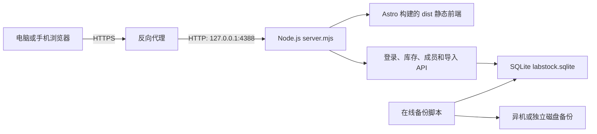
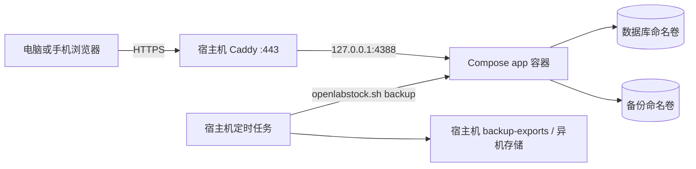

# OpenLabStock 构建路线与系统架构

> 本文只描述可公开、可复用的应用架构。真实域名、服务器、客户和共用站点拓扑不得进入本仓库；边界见[仓库与文档治理](./REPOSITORY_GOVERNANCE.md)。

## 1. 项目目标

OpenLabStock 是面向实验室与科研团队的耗材出入库系统。部署者可以配置自己的 HTTPS 域名和实验室显示名称，应用与二维码协议不依赖固定域名。

核心目标：

- 每位成员使用独立账号和密码登录，不依赖邮箱。
- 成员可以登记入库、出库，并搜索已有耗材。
- 所有启用成员都能进入成员目录，查看姓名、组织分组、职责标签和成员主动公开的负责范围/联系方式备注。
- 按系统所有者、系统管理员、库存管理员和普通成员分配权限。
- 支持 Excel、CSV 导入，支持带固定回导工作表的库存统计和流水导出。
- 同时适配电脑和手机，界面采用 Material 3 风格。
- 与同一父目录中的其他网页项目完全隔离。
- 适合单个实验组、约 60-100 名成员在一台服务器上使用。

## 2. 建设路线

### 2.1 先确定业务边界

参考了 Snipe-IT、ERPNext Stock 和 Odoo Inventory 的库存台账、权限、流水和预警思路，但没有直接部署完整 ERP。

OpenLabStock 保留了实验组真正需要的部分：

- 耗材台账
- 入库和出库流水
- 当前库存与安全库存线
- 成员和管理员权限
- 组织分组与成员标签
- Excel 导入导出
- 库存预警

暂时没有加入采购审批、财务、销售、多仓库调拨和复杂工作流，以免日常登记变得过重。

### 2.2 建立独立项目

项目位于独立目录 `labstock/`，拥有自己的：

- `package.json`
- `node_modules/`
- Astro 配置
- `dist/` 构建目录
- SQLite 数据目录
- 本地端口 `4388`

因此它不会修改或占用同级其他网页项目的文件。当前线上实例也使用独立的域名、Node 服务、应用目录和数据目录。

### 2.3 先完成可用流程，再逐步加固

建设顺序大致为：

1. 登录、总览、库存和流水界面。
2. 手动入库、出库和新耗材创建。
3. 管理员成员管理、密码重置、停用和删除。
4. Excel、CSV 导入和统计导出。
5. 实验室品牌、组织分组和安全库存线设置。
6. 统一 Material 3 下拉菜单、弹窗、按钮和移动端布局。
7. 从 JSON 文件存储迁移到 SQLite 事务数据库。
8. 增加跨进程会话、并发写入保护、备份和安全响应头。
9. 构建不含源码依赖的生产部署包，通过 Caddy 和 systemd 上线。
10. 增加四级权限、所有权转移、所有者密码恢复、成员目录与备注、以及旧数据库自动升级。
11. 让普通成员查看完整库存和流水，并增加仅系统所有者可用的网页数据库备份/恢复。
12. 增加唯一组织分组、多选成员标签、流水组织快照和分组耗材消耗导出。
13. 增加状态化库存和库存单元，以同一通用模型覆盖盒、批次、序列、位置、开放/自用和可用性状态。

## 3. 总体架构

浏览器只访问 HTTPS 反向代理的 `80/443`。Node 默认仅监听 `127.0.0.1:4388`，不直接暴露到公网。

## 4. 技术和工具

### 4.1 前端

- **Astro**：构建静态页面和打包前端资源。
- **TypeScript**：实现页面状态、API 调用、筛选、弹窗和导入导出逻辑。
- **Lucide React**：提供统一的 Material 风格功能图标。
- **SheetJS/xlsx**：浏览器端解析 Excel，并生成库存统计工作簿。
- **原生 HTML/CSS**：实现响应式布局、Material 3 视觉语言和无框架表单交互。

前端最终构建到 `dist/`，生产服务器不需要运行 Astro，也不需要在服务器上安装 pnpm。

### 4.2 后端

- **Node.js 24**：运行 HTTP 服务；最低要求为 Node.js 22.12。
- **`server.mjs`**：静态文件服务、API、登录、权限和输入校验。
- **Node 内置 `node:sqlite`**：不需要额外安装数据库服务或原生依赖。
- **`storage.mjs`**：数据库结构、旧数据迁移、事务和增量写入。

### 4.3 构建和质量检查

- **pnpm 11**：本地依赖和构建管理。
- **Astro Check + TypeScript 5.9**：检查 Astro 模板、前端 TypeScript 和组件类型；TypeScript 主版本固定，避免检查器兼容性漂移。
- **Node Test Runner**：接口、权限、并发、生产初始化和数据库完整性测试。
- **Playwright**：在隔离临时数据库中回归真实登录、二维码直达、登记确认和库存写入，覆盖桌面与 `390 x 844` 手机视口。
- **`pnpm audit --prod`**：检查生产依赖的已知漏洞。
- **浏览器响应式检查**：桌面和 `390 x 844` 手机视口检查布局、溢出和交互。

质量门禁分为三级：日常修改运行 `pnpm run verify:quick`；主分支合并由 CI 运行 `pnpm run verify`；正式发布在完整验证后再做一次浏览器验收、独立解包生产烟测与健康检查，不在解包目录重复完整测试。数据库迁移、权限、认证、备份恢复、二维码和 Docker 等高风险变更不使用快速门禁替代完整验证。

### 4.4 生产运行

- **Caddy 或等效反向代理**：终止 HTTPS，并把站点请求转发到 `127.0.0.1:4388`；公共示例域名使用 `inventory.example.org`。
- **systemd**：开机启动、异常重启、权限隔离和日志管理。
- **Docker Compose（可选）**：把同一 Node 单实例封装为非 root、只读根文件系统的健康检查容器；数据库和备份使用独立持久卷，宿主机 Caddy 仍负责 HTTPS。
- **SCP/SFTP 客户端**：在需要时上传已验证的生产包；数据库备份应走受控渠道。
- **SQLite 在线备份脚本**：生成一致性数据库快照并执行完整性检查。

## 5. 代码和目录职责

| 文件或目录 | 用途 |
| --- | --- |
| `src/pages/index.astro` | 页面结构、样式、弹窗和响应式布局 |
| `src/scripts/app.ts` | 前端状态、API、Material 菜单、导入导出和事件处理 |
| `src/scripts/material-qr.mjs` | 耗材 UUID 校验、二维码网址生成与扫码文本解析 |
| `src/scripts/record-pagination.mjs` | 通用数组分页边界与页码修正 |
| `src/scripts/record-page.mjs` | 前端记录页筛选 URL、游标历史、范围与翻页状态 |
| `src/server/record-query.mjs` | 服务端记录游标、筛选参数和可见范围协议 |
| `src/server/transaction-read.mjs` | 流水分页、完整导出和旧版兼容读取控制器 |
| `src/server/login-attempts.mjs` | 有容量上限和过期清理的登录失败限制 |
| `src/server/quantity-import.mjs` | 普通数量 Excel 导入的整批校验、目标库存与差额流水计划 |
| `server.mjs` | HTTP 服务装配、登录、权限、写接口和安全策略 |
| `storage.mjs` | SQLite 表结构、事务、增量保存和旧 JSON 迁移 |
| `password.mjs` | 服务端与恢复工具共用的 scrypt 密码哈希实现 |
| `scripts/backup.mjs` | SQLite 一致性备份、校验和保留策略 |
| `scripts/reset-owner-password.mjs` | 在服务器终端恢复系统所有者密码并清除其旧会话 |
| `scripts/generate-pwa-icons.py` | 可重复生成普通、Apple 与 maskable PWA PNG 图标 |
| `tests/api.test.mjs` | API、权限、并发、会话和生产初始化测试 |
| `tests/e2e/critical-flow.spec.mjs` | 桌面与手机浏览器的登录、二维码定位和单次库存写入回归 |
| `playwright.config.mjs` | 浏览器项目、视口和失败诊断产物配置 |
| `public/manifest.webmanifest` | 联网型 PWA 的安装名称、范围、主题色和图标声明 |
| `public/sw.js` | 只缓存版本化安装图标的受限 Service Worker |
| `public/icons/` | 不包含具体实验室名称的 PWA 安装图标 |
| `dist/` | 构建后的生产前端资源 |
| `deploy/` | systemd、Docker、环境变量和 Caddy 部署文件 |
| `data/` | 本地开发数据库，不进入生产包和 Git |

## 6. 数据模型

SQLite 中的主要表：

- `settings`：左上角名称、实验室名称和品牌图标。
- `groups`：课题组、公共平台等内部组织分组和默认分组；每位成员唯一归属一个组织。
- `tags`：采购负责人、危化品等可多选职责标签词表。
- `user_tags`：成员与职责标签的多对多关联。
- `users`：不可变内部 UUID、可修改登录账号、显示姓名、成员备注、角色、状态、密码哈希和最近登录时间。
- `materials`：耗材名称、分类、当前库存、安全库存、单位、规格型号、库存管理方式和使用/归档状态。
- `inventory_statuses`：每种状态化耗材的可自定义状态名称，以及固定的可用/终止语义。
- `inventory_units`：盒、容器、批次、序列或按状态统计使用的系统聚合单元，使用不可变 UUID。
- `inventory_unit_balances`：库存单元内按状态、开放/自用、成员 UUID 和位置编号拆分的当前数量。
- `inventory_events`：不可删除的状态、使用范围、位置、处置和修正事件快照。
- `transactions`：不可随意修改的入库和出库历史流水；保存发生时的组织 ID、组织名称、记录来源、库存单元、状态、使用范围和位置快照。数据库字段仍叫 `counterparty`，界面和导出按业务语义显示为“来源 / 去向”。
- `stocktakes`：盘点批次、任务状态、创建/完成/取消人员与时间，以及必填的取消原因。
- `stocktake_items`：创建批次时固定的耗材或库存单元账面快照，以及实盘数量、差异原因、处理说明和自动调整流水关联。
- `audit_logs`：只能追加的管理操作记录；保存操作者身份快照、动作、对象、变更前后摘要、来源地址、请求编号和发生时间。
- `sessions`：登录会话的哈希、所属用户和过期时间。
- `metadata`：数据库初始化状态、结构版本和唯一的 `owner_user_id`。

普通数量耗材的当前库存保存在 `materials`。状态化耗材由 `inventory_unit_balances` 汇总，汇总总数同步到 `materials.quantity`，开放且可用数量单独计算。出入库和处置写入 `transactions`，状态、使用范围及位置变化写入 `inventory_events`，兼顾页面查询速度和完整追溯。

登录账号只是登录名，可以修改；成员内部 UUID 不变，历史流水和自用库存也不会因改账号而断开。系统所有者同样由 UUID 绑定，而不是写死为 `admin` 账号。旧数据库启动时会在事务中自动补齐角色约束、成员备注、耗材状态、标签表、流水组织快照、状态化库存表、材料级登记说明、使用登记与流水冲销关联、系统审计表和盘点表，并升级到结构版本 14，原账号、密码、库存、流水和自定义品牌名称保持不变。版本 14 新建 `stocktakes`、`stocktake_items` 及查询索引；版本 13 新建 `audit_logs` 及查询索引，迁移前没有发生过的管理操作不会被反向推测或伪造。版本 11 在同一迁移事务中为流水和库存事件补齐按“发生时间 + 不可变 ID”排序的索引；旧流水能匹配到成员时会补入当时可推定的组织，无法匹配时保留为空并在导出显示“历史未归属”。

组织和标签承担不同职责：课题组、公共平台等属于唯一的内部“组织分组”，用于成员归属和消耗核算；采购负责人、危化品、光刻等属于可多选“成员标签”，仅用于职责展示、搜索和筛选。成员调组、组织改名都不会改写已有流水的组织快照。`sourceType=manual` 表示网页人工登记，`sourceType=inventory_adjustment` 表示 Excel 库存差额调整；后者不纳入人工分组消耗。

耗材档案采用简化生命周期：`active=true` 为使用中；`active=false` 为已归档。归档要求库存为 0，并从日常统计、预警、出入库候选和可回导工作表排除。库存管理员可归档和恢复；系统管理员可永久删除库存为 0 的档案。流水已保存名称、单位和 `materialId` 快照，因此永久删除档案后历史流水仍完整可读，但被删除档案不可恢复，后来重建的同名耗材会获得新的 UUID。

库存工作簿固定包含“可导入库存”六列，并只列出普通数量耗材。导入时优先识别该工作表，兼容旧版“逐耗材统计”，并在前端显示工作表和行数后要求二次确认。导入值是目标当前库存，系统只为差额生成可追溯流水，累计入库/出库等派生统计不会被当作事实写回。状态化和按库存单元追踪的耗材由后端拒绝普通表覆盖。

完整导出由 `/api/transactions?mode=export` 在一个 SQLite 只读事务内固定快照，再从同一时点读取设置、组织、成员目录、当前库存、逐耗材统计、普通流水和库存事件。浏览器生成库存 Excel 或审计 CSV 时只能使用这一份响应，不能再把较早的 `/api/bootstrap` 库存与较新的全量流水拼接。导出可与 WAL 写事务并行；导出结果可能位于同时写入的前一刻或后一刻，但其当前库存和自身流水净额必须相互一致。

系统保留四类互不替代的事实：`transactions` 记录库存数量变化，`inventory_events` 记录状态化库存的使用、状态、范围、位置和更正，`stocktakes`/`stocktake_items` 记录某次盘点的账面快照、实盘结果和差异复核，`audit_logs` 记录管理员及库存管理员执行的配置与管理动作。盘点完成时，普通数量耗材差异通过 `sourceType=inventory_adjustment` 的不可变流水落账；状态化或按库存单元追踪的耗材必须先在既有库存明细中修正具体状态、归属或位置，盘点本身不猜测物理对象。系统审计不重复普通领用和日常使用登记，但会记录盘点创建、实盘更新、完成和取消。除数据库备份与整库恢复的特殊边界外，审计写入与对应业务修改共用同一个 `BEGIN IMMEDIATE` 事务；业务失败不会留下成功审计，审计失败也不会提交业务修改。系统所有者和系统管理员可通过 `/api/audit-logs` 按操作者、对象类型、时间和关键词分页查询并导出；库存管理员与普通成员无查看权限。

审计快照过滤密码、密码哈希、盐、令牌、会话、品牌图片内容、数据库与上传文件内容，只保存排查所需摘要。审计表没有网页修改、删除或自动清理接口，记录随主数据库备份、恢复和保留；当前低频单实验室规模默认长期保留。它用于日常追溯，不是外置 WORM 或密码学防篡改日志：拥有服务器和数据库文件写权限的运维人员仍可直接修改文件，若合规要求更高，应把日志同步到独立的追加式存储。

数据库备份 API 使用 `VACUUM INTO` 生成不依赖 WAL 边车文件的 SQLite 快照。恢复先用当前所有者密码换取五分钟、一次性 ASCII token，再上传原始 SQLite 二进制；服务会检查 SQLite magic、完整性、外键、必要表、结构版本、默认分组和唯一有效所有者，创建 `pre-restore-时间.sqlite` 快照后原子替换，并清空恢复库中的登录会话。

## 7. 身份和权限模型

| 身份 | 人数 | 库存和完整流水 | 品牌、分组和成员 | 管理系统管理员 | 转移所有权 |
| --- | --- | --- | --- | --- | --- |
| 系统所有者 | 唯一 | 完整权限 | 完整权限 | 可以 | 可以 |
| 系统管理员 | 可多人 | 完整权限，含永久删除零库存耗材档案 | 可管理库存管理员和普通成员 | 不可以 | 不可以 |
| 库存管理员 | 可多人 | 维护、归档和恢复耗材，管理安全库存、导入导出、查看全部流水 | 不可以 | 不可以 | 不可以 |
| 普通成员 | 可多人 | 登记出入库、查看和导出完整库存与流水 | 不可以 | 不可以 | 不可以 |

系统所有者不能被停用、删除或直接降级。所有权只能转移给一位处于启用状态的系统管理员，操作前必须再次验证当前所有者密码。转移完成后，原所有者保留系统管理员身份。系统管理员不能修改系统所有者或其他系统管理员的资料、角色、密码和状态。

系统审计仅对系统所有者和系统管理员开放；系统管理员可以查看库存管理员产生的耗材与库存配置管理记录。审计入口不进入四个高频移动底部导航项，通过系统导航进入。

盘点任务由库存管理员、系统管理员和系统所有者使用。创建任务可选择全部使用中耗材、一个分类或搜索指定单项耗材，并固定当前账面快照；单项范围用于临时抽盘和异常复核，追踪耗材会纳入其全部在用库存单元。系统拒绝与其他未完成盘点重叠；完成前要求所有项目已经实盘、差异原因完整、追踪库存已通过库存明细修正且普通库存快照没有在盘点期间变化。取消任务必须填写原因。盘点入口位于库存页“更多库存操作”，不增加高频导航项。

成员目录对普通成员只返回公开资料；系统管理员在同一份目录卡片右侧管理可管理账号，目录默认按姓名中文拼音/英文字母 A-Z 排序。这样避免“成员目录”和“实验室成员账号表”重复，同时仍保留停用账号的恢复入口。

## 8. 并发和一致性设计

早期文件存储不适合多个 Node 进程同时修改，因为两个进程可能读取相同旧数据并互相覆盖。当前方案改为 SQLite：

- 启用 WAL 模式，读取和写入可以并行。
- 使用 `PRAGMA synchronous = FULL`，优先保证落盘可靠性。
- 每个修改请求执行 `BEGIN IMMEDIATE`，先取得写锁，再读取最新库存、校验和写入。
- 一个请求提交成功后才向浏览器返回成功。
- 默认最多等待数据库写锁 10 秒；超时返回 `503` 和 `Retry-After`，页面提示本次操作没有保存。
- 两个独立 Node 进程共享同一本地 SQLite 数据库的并发测试中，100 次写入均被正确保存。

SQLite 文件必须放在应用服务器的本地磁盘，不应放在 SMB、NFS 等网络共享盘。

## 9. 登录和安全设计

- 用户名和密码登录，不需要邮箱。
- 密码使用随机盐和 scrypt 哈希，数据库不保存明文密码。
- 新密码最低 8 位，不强制字符组合；生产管理员仍应使用不与其他网站共用的密码。
- 登录失败同时按“客户端地址 + 账号”和客户端总量限速，兼顾固定账号暴力尝试与账号名轮换攻击；失败记录有固定窗口、过期清理和容量上限，受限响应附带 `Retry-After`。
- 会话令牌使用高强度随机数，数据库只保存令牌的 SHA-256 哈希。
- 生产 Cookie 使用 `HttpOnly`、`Secure`、`SameSite=Strict` 和 `__Host-` 前缀。
- POST、PATCH、DELETE 请求执行同源检查，降低跨站请求伪造风险。
- 响应包含 CSP、HSTS、禁止 iframe、禁止 MIME 猜测等安全头。
- systemd 服务以无登录权限的 `openlabstock` 用户运行，只允许写入 `/var/lib/openlabstock`。
- 生产初始化只创建一个系统所有者和空库存，不生成演示成员或演示耗材。
- 所有者忘记密码时只能由有服务器管理权限和 `openlabstock` 数据目录权限的维护人员运行恢复工具；工具生成临时密码、清除旧会话且不修改用户 UUID 或业务数据。

## 10. 导入和导出设计

### Excel/CSV 导入

导入文件描述的是“导入后应有的当前库存”，不是额外入库数量。系统比较原库存和目标库存，并自动生成差额流水：

- 目标库存大于当前库存：生成入库调整。
- 目标库存小于当前库存：生成出库调整。
- 新耗材：生成期初库存流水。

单次最多导入 500 行，并检查重复名称、数字、单位和字段长度。

### 库存统计导出

工作簿包含：

- `库存概览`：使用中耗材的种类、分类数和预警数量，并列出归档档案数。
- `分类统计`：每个分类中使用中的耗材数和预警数。
- `组织分组概览`：各内部组织的启用成员、手工出库记录、涉及耗材和最近出库。
- `分组耗材消耗`：按流水发生时的唯一组织分组、耗材和单位汇总手工出库，不含 Excel 库存调整。
- `逐耗材统计`：每一种使用中或已归档耗材的档案状态、开放可用库存、库存总数、管理方式、安全库存、单位、累计入库、累计出库、记录次数和最近时间。
- `可导入库存`：只包含使用中的普通数量耗材，回导不能静默恢复归档耗材，也不能覆盖状态化库存。

历史上更换过单位时，不把不同单位直接相加，而是将其他单位单独列出。

## 11. 界面特点

- 使用克制的 Material 3 色彩、层级、状态色和交互反馈。
- 输入框、下拉菜单、自动完成、分段控制和弹窗保持统一。
- 成员管理页直接说明四种身份权限，各身份只看到自己可用的入口。
- 成员目录可搜索姓名、备注、组织分组和标签，并可按身份、组织、标签筛选；不把账号名、最近登录等管理信息暴露给普通成员。成员本人可以在系统设置维护姓名、备注和已有职责标签，上级管理员可维护下级成员资料。
- 面向成员的高频任务统一显示为“领用 / 使用登记”：普通数量耗材在登记表单扣减数量，状态化耗材选择后进入盒子或位置明细。数据层和 API 继续使用兼容的 `type=in/out`，趋势、导出和正式账务语境仍可显示“出库”，不得为界面改名迁移历史类型。
- 领用候选按当前成员完整历史计算个人最近活动顺序：普通耗材使用有效手工出库，状态化耗材使用状态、范围和位置变更；排除 Excel 调整、冲销与处置。首屏只返回少量耗材 UUID 排序提示，空输入或同等匹配时最近使用优先，文字搜索仍覆盖全部在用耗材；入库候选保持名称排序。
- 记录页使用同一个 Material 3 分段控件切换“全部记录 / 我的记录”。“我的记录”按当前成员不可变 UUID 同时筛选普通流水与库存状态事件；不得按姓名或可修改登录账号筛选，也不另建一份容易产生口径差异的记录页面。
- 入库字段标记为“来源（供应商）”，出库字段标记为“去向（房间号 / 领用人 / 项目）”；这里的房间号是物理去向，不是课题组、公共平台等内部组织。流水表和导出使用“来源 / 去向”并附带类型列，避免把所有场景误称为供应商。
- 总览库存预警显示全部预警耗材，并在固定区域内滚动，避免与快捷操作区域高度失衡。
- 手机端使用底部导航、响应式表格和卡片式流水记录。
- 手机库存页按命令频率分层：扫码与“领用 / 使用登记”保持直接可见，批量标签、新增、导入、模板和导出进入右上角 Material 溢出菜单；桌面端继续直接展示完整工具栏。命令菜单沿用角色权限隐藏，不通过缩小字体或按钮文字换行硬塞操作。
- 手机弹窗使用 `VisualViewport.height` 和 `VisualViewport.offsetTop` 跟随输入法造成的缩放与平移；输入法打开时取消底部安全间距并收起底部圆角，使弹窗不透出后方页面，收起输入法后恢复常规 Material 对话框外观。手机抽屉和遮罩采用同一可视视口定位逻辑。
- 长耗材名称允许换行，固定列宽避免动态内容造成布局跳动。
- 所有操作都有加载、成功、失败或库存不足提示。

### 首屏性能与等待反馈

- `/api/public-settings` 只返回公开名称和带内容哈希的品牌图标 URL；图标由 `/api/brand-icon` 独立返回，使用 `ETag` 和长期不可变缓存，不在公开设置与登录后数据中重复传输 Base64。
- `/api/bootstrap` 只返回最近 30 条流水和完整总数。总览、库存和成员可以先进入；记录页和全局记录搜索通过 `/api/transactions?mode=page` 按查询词、类型、本人范围和起始时间在服务器筛选，使用稳定游标每页读取 60 条并返回 `COUNT`。
- `/api/transactions` 的身份、流水和库存事件使用 SQLite 定向只读查询，不再为记录页映射完整业务 Store。完整 CSV 和库存 Excel 导出显式使用 `mode=export`，由服务端在单个读事务中返回当前库存与完整历史的同一时点快照；不能复用当前显示页、首屏子集或另一请求取得的库存。旧的兼容响应只在迁移窗口保留。
- 月度统计、趋势和逐耗材统计仍由服务器按完整历史计算。前端不能用首屏 30 条子集重新计算完整报表。
- 工作台加载超过约 200 毫秒才显示 Material 3 线性进度，避免快速响应时闪烁；超过 8 秒给出网络提示和重试入口。完整流水加载只占用记录区域，不阻塞其他页面。
- 正文、数据、按钮和输入控件以 14px 为基本层级，辅助说明、标签和表头最低 12px。头像首字等非正文图形可使用 11px；长文本通过稳定网格、`min-width: 0`、省略或换行处理，不以缩小字体解决溢出。

### 浏览器缓存边界

- Astro 构建的 CSS/JS 文件名包含内容哈希，使用 `Cache-Control: public, max-age=31536000, immutable`。
- 自定义品牌图标使用图标二进制内容的 16 位 SHA-256 前缀作为 URL 版本，同样长期缓存；请求哈希与当前图标不一致时返回 404，避免在旧 URL 下缓存新内容。
- `index.html` 与公开品牌设置使用 `no-cache + ETag`。浏览器可保留本地副本，但每次会确认版本；内容未变时只收到 304，管理员修改品牌后也不会长期粘住旧内容。
- `manifest.webmanifest` 与 `sw.js` 同样使用 `no-cache + ETag`；带 `v1` 文件名的 PNG 安装图标可长期不可变缓存，图标内容变化时必须改文件名版本。
- 除公开品牌设置外，登录态、库存、成员、流水和其他业务 API 都使用 `no-store`，不进入浏览器持久缓存，避免为了速度牺牲实时性、正确性或权限隔离。

## 联网型 PWA 架构

PWA 只改善安装和独立窗口体验，不改变“浏览器实时连接单一服务器”的数据模型。Service Worker 不处理页面导航、manifest、`/api/`、数据库下载或任何非 GET 请求，也不使用 Background Sync。断网时业务提交必须失败，恢复网络后由用户明确重试，不能自动重放出入库操作。

Service Worker 仅在 HTTPS 或 localhost 等安全上下文注册，并通过 `updateViaCache: none` 检查自身更新。固定 PNG 图标进入独立的版本缓存；新 Service Worker 激活时只删除由相同 PWA 缓存前缀创建的旧图标缓存，不触碰浏览器 HTTP 缓存或其他应用数据。完整决策与验收见 [PWA_MOBILE_APP.md](./PWA_MOBILE_APP.md)。

## 二维码出入库架构

耗材二维码采用“稳定 UUID + 当前站点直达网址”，不编码名称、库存或登录信息。状态化库存还支持绑定库存单元 UUID 的盒、批次或序列二维码。两类扫码都只定位档案或库存单元，再进入人工确认表单，后端写入路径没有新增旁路，因此扫码不会绕过登录、角色、归档状态、库存余额或事务校验。

直达网址从浏览器当前 origin 和部署路径生成，不硬编码产品域名；同一构建部署到 `inventory.example.org` 等站点后会自然生成对应域名标签。已有实体标签迁移域名时必须保留旧域名的参数透传跳转或重新打印。

二维码生成使用 `qrcode`，摄像头和图片识别使用 `@zxing/browser`。两者都通过动态 `import()` 按需加载：普通登录、刷新、查看库存时不会下载扫描核心；只有打开二维码标签或扫描器时才加载对应分块。摄像头响应头限制为同源，HTTP/IP 访问回退到图片识别或系统相机直达链接。完整流程、参考项目和验收清单见 [QR_CODE_WORKFLOW.md](./QR_CODE_WORKFLOW.md)，状态化库存模型见 [INVENTORY_TRACKING.md](./INVENTORY_TRACKING.md)。

## Docker 可选部署架构

Docker 路线仍是单机、单 Node、SQLite 本地磁盘架构，不把系统伪装成可水平扩展服务：

镜像使用 Node 24 官方 Debian slim。构建阶段安装锁定依赖并生成 Astro `dist`；运行阶段只复制 Node API、SQLite 数据层、脚本与已构建前端，不携带 pnpm、源码依赖或编译工具。容器由 `node` 用户直接执行 `node server.mjs`，Compose 使用 `init` 转发信号；服务端收到 SIGTERM 后停止接收请求、等待在途写事务完成并关闭数据库。

命名卷比容器可写层更适合 SQLite I/O，也不会随容器重建消失。数据库卷与备份卷分开，但同一宿主磁盘仍不是灾难恢复方案；`backup` 命令会额外复制快照到宿主机目录，后续应同步到异机或对象存储。

## 12. 当前适用范围和后续演进

当前架构适合：

- 一个实验组
- 一台应用服务器
- 约 60-100 名成员
- 中低频日常出入库登记

后续数据量明显增长时，优先增加：

1. 管理员可选 TOTP 二次验证。
2. 继续把状态、单元和余额集合同步细化为逐行 SQL，并逐步删除旧全量兼容路径；服务器端筛选、游标分页和 `COUNT` 已完成，50k 条隔离基准中记录第一页 p95 约 8.3 ms。普通数量出入库、更正和 Excel 差额调整已使用事务内定向写入，既有 p95 分别为 5.9 ms、20.3 ms 和 138.8 ms（500 行）；状态化库存操作已只映射当前库存领域、不再加载完整历史，复测 p95 约 5.4 ms。
3. 自动同步到异机或对象存储的备份。
4. 结合真实扫码、系统推送或 MDM 需求，再决定是否增加原生壳；不因“像 App”而引入离线数据一致性风险。

完整导出仍会把全历史 JSON 传到浏览器，并在浏览器内生成文件。50k 条合成历史的单次完整响应约 1.20 秒、审计工作簿生成约 3.64 秒，当前规模可用，但它不是无限扩展路径；当实际导出内存、响应大小或登记干扰达到阈值时，应先改为服务端流式 CSV、分批工作簿或异步导出任务。

只有在需要多台应用服务器、高可用、多个实验室共用、持续高写入并发或大量外部系统集成时，才有必要从 SQLite 迁移到 PostgreSQL。网页数据库恢复会暂停当前单 Node 实例的请求、替换数据库并清空全部 sessions；多实例同时连接同一数据库时必须先停掉其他实例后再恢复。
